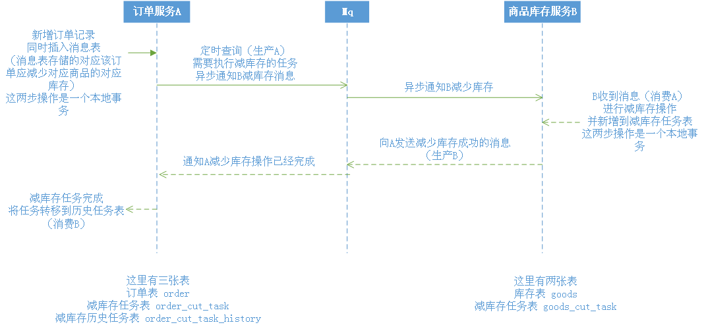

# 使用RabbitMQ实现分布式事务的最终一致
基于RabbitMQ协议，简单的模拟下单减库存

下面是简单的时序图：

[RabbitMQ安装](https://www.rabbitmq.com/download.html)

MySql5.7的安装，我使用的是二进制包进行安装，它的安装看自己习惯

MySql可以参考我的 mysql-install.sh 进行安装

----
### 测试步骤

1、首先，配置2台不同MySql5.7服务器，一台作为商品服务（192.168.88.129），另一台作为订单服务（192.168.88.130）

2、分别执行rabbitmq目录下的sql文件，我测试的配置是：

    服务器：192.168.88.129 商品服务 
        192.168.88.129.sql
    服务器：192.168.88.130 订单服务
        192.168.88.130.sql
    采用同样的授权（如果在xa已经授权，无需重复授权）：
        mysql-grant.sql

3、命令行运行减库存的任务的脚本（减库存消费者），切换到goods-service目录，执行
    
    php GoodsTask.php
4、命令行运行减库存完成任务的脚本（减库存完成消费者），切换到order-service目录，执行

    php FinishTask.php
5、命令行运行定时减库存的任务的脚本（异步消费，通知减库存消费者），在order-service目录，执行

    php Command.php
6、命令行或者浏览器，执行order-service目录下的Order.php，生成订单
    
    运行一次生成一单
    php Order.php
    
    浏览器访问：http://address/Order.php
        
        
    你也可以使用OrderMany.php脚本插入多单（下面的100就是生成订单的数量）
    php OrderMany.php 100
    
    浏览器访问：http://address/OrderMany.php?num=100

